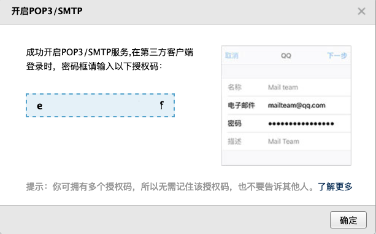

# 使用 python 发邮件  

## 1. SMTP 协议  
SMTP（Simple Mail Transfer Protocol ）：简单邮件传输协议。python 默认支持该协议，使用该协议可以构造纯文本和带附件的邮件。该协议其中包含两个模块：smtplib（发邮件）、email（构造邮件）。

## 2. 纯文本邮件

### 2.1 邮箱设置  
以QQ邮箱为例:  
1. 先设置邮箱授权码  
设置 -> 账户 -> POP3/IMAP/SMTP/Exchange/CardDAV/CalDAV服务 -> 开启POP3/SMTP服务  

2. 配置邮件客户端  
按提示，编辑短信，获取授权码。  

