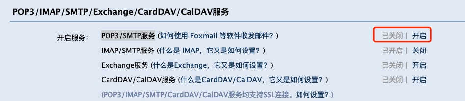
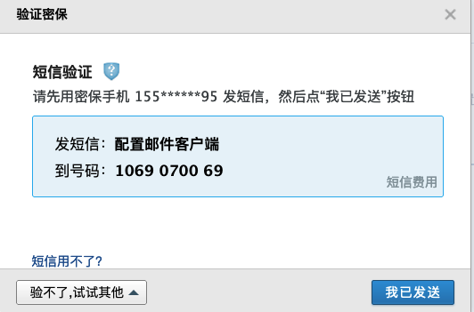
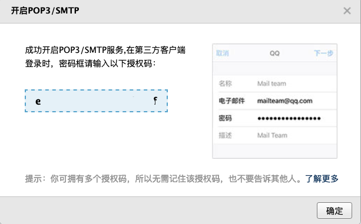
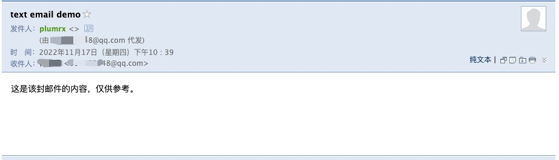

---
title: python-发邮件
date: 2022-11-17 20:04:12
tags:
---


# 使用 python 发邮件  

## 1. SMTP 协议  
SMTP（Simple Mail Transfer Protocol ）：简单邮件传输协议。python 默认支持该协议，使用该协议可以构造纯文本和带附件的邮件。该协议其中包含两个模块：smtplib（发邮件）、email（构造邮件）。

## 2. 纯文本邮件

### 2.1 邮箱设置  
以QQ邮箱为例:  
1. 先设置邮箱授权码  
设置 -> 账户 -> POP3/IMAP/SMTP/Exchange/CardDAV/CalDAV服务 -> 开启POP3/SMTP服务  

2. 配置邮件客户端  
按提示，编辑短信，获取授权码。  




### 2.2 邮件编辑与发送  
```
 调用 SMTP 发件服务
import smtplib
# 导入纯文本的邮件模板类
# MIMEText 类被用来创建主类型为 text 的 MIME 对象
from email.mime.text import MIMEText

# 配置发送参数
# QQ邮箱服务器
smtp_server = 'smtp.qq.com'
sender = '664078648@qq.com'
auth_code = 'ekmmmufolpjrbehf'
receiver = '664078648@qq.com'
# QQ邮箱服务器默认端口号
port = 465

# 编写邮件正文
body='这是该封邮件的内容，仅供参考。'
msg = MIMEText(body, 'html', 'utf-8')
# 发件人名称展示
msg['from'] = 'plumrx'
msg['to'] = receiver
msg['subject'] = 'text email demo'

# 登录采用SSL方式，安全套接字层，可确保互联网连接安全，保护两个系统之间发送的任何敏感数据，防止网络犯罪分子读取和修改任何传输信息。
# 调用发件服务
smtp = smtplib.SMTP_SSL(smtp_server, port)
# 登录
smtp.login(sender, auth_code)
# 发送邮件，以字符串拼接
smtp.sendmail(sender, receiver, msg.as_string())
# 关闭邮件服务
smtp.quit()

```  
   

